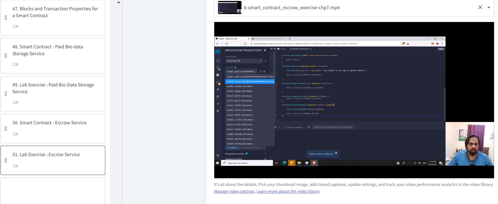

# Escrow-Service-Smart-contract
This contract I have built for the Alnafi students to teach them how an Escrow smart contract can work between Seller and buyer. How a seller can deposit his tokens for the period of time till he doesn't receive the item for which he would like to pay. The entire exercise video is available on the Alnafi paid program.

